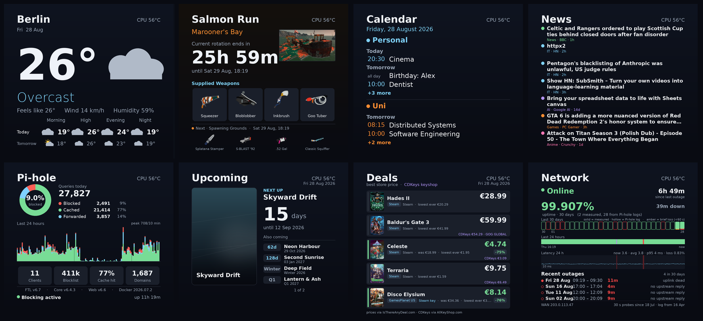
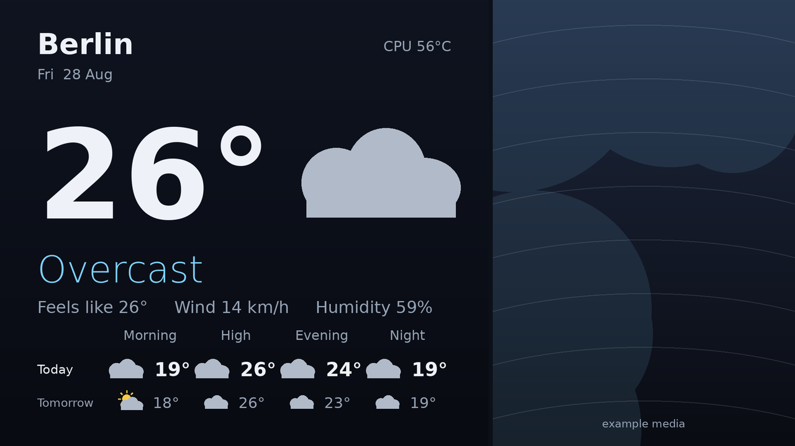
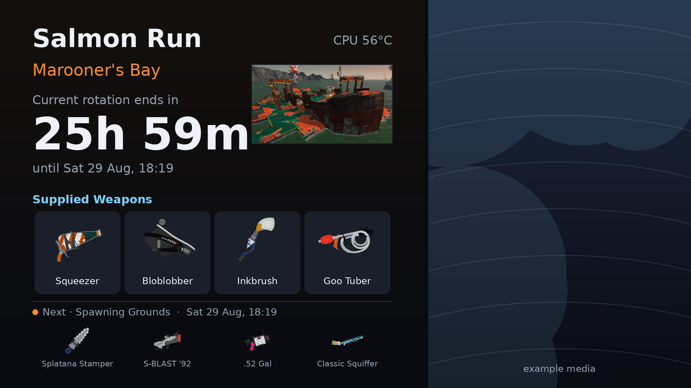
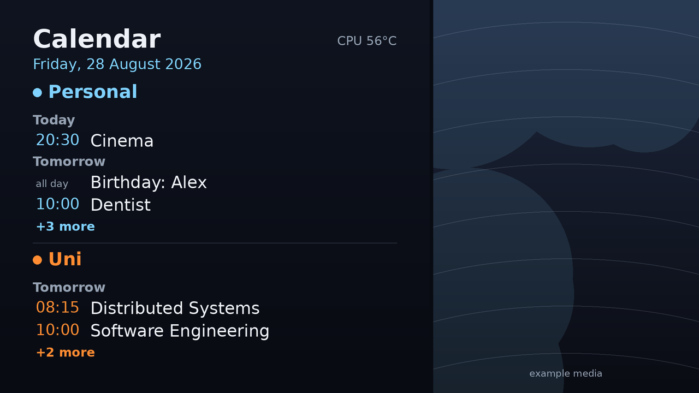
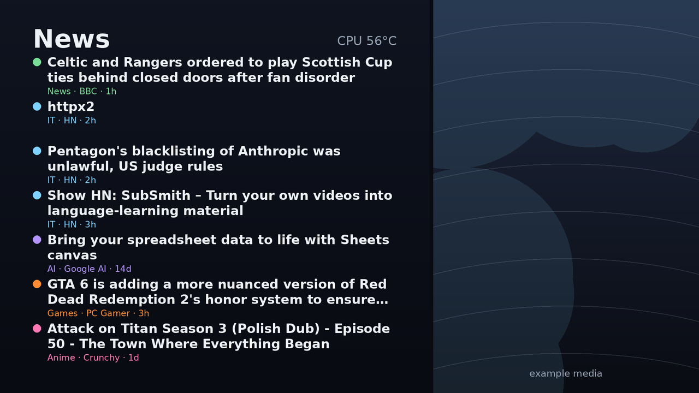
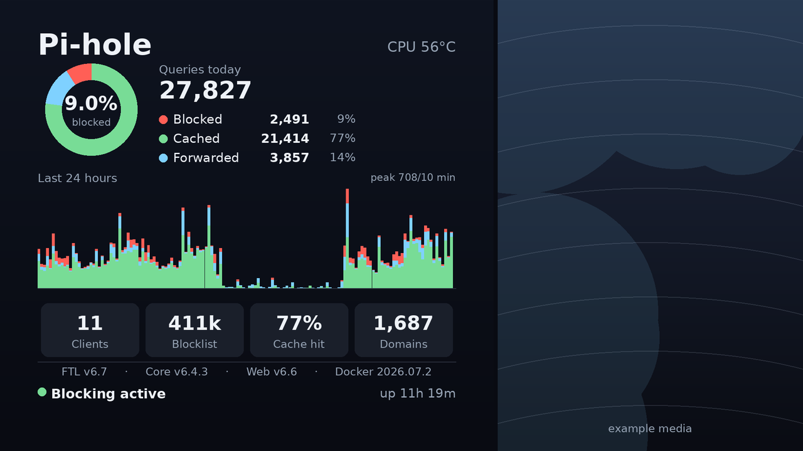
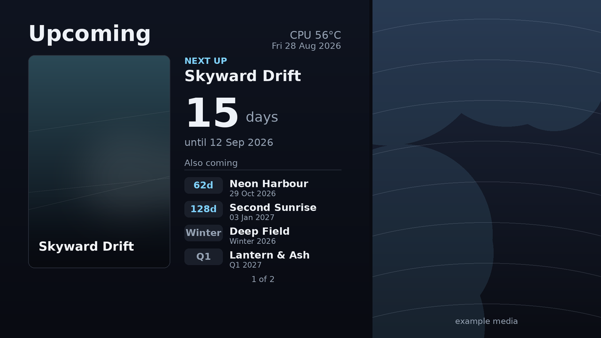
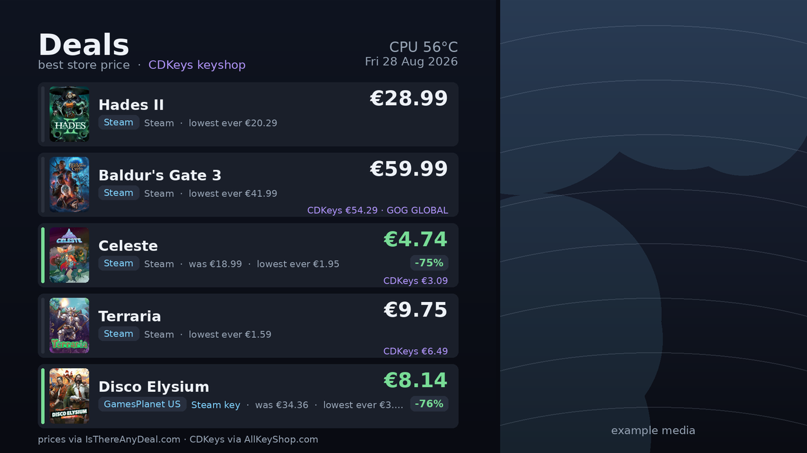
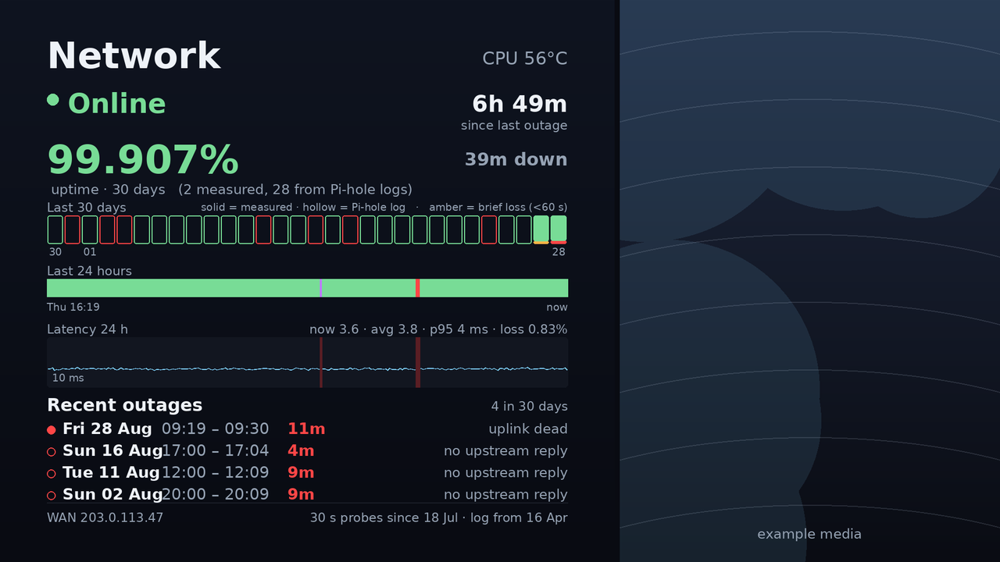

# Infoscreen

A small always on information display for a Raspberry Pi. Eight screens take turns on the left
side of a 1920x1080 HDMI touch display while a clip or a still image loops on the right,
fullscreen, with no browser and no desktop anywhere in sight.



The unusual part is that **mpv is the entire display**. There are no compositor tricks, no web
view and no window manager chrome. One mpv process plays the media in the right 38% of the screen
and paints everything else as GPU overlays on top of it. A Lua script running inside mpv decides
which screen is showing, renders the next one before switching to it, and routes touches. The
screens themselves are ordinary Python scripts that draw a bitmap with Pillow and drop it
somewhere mpv can read it.

That design came out of a failure. The first version was an HTML kiosk in Firefox, and it thrashed
swap on a 4 GB Pi hard enough to starve the Pi-hole running on the same box. DNS for the whole
flat would stall because a weather page was busy collecting garbage. The replacement had to be
able to sit at a few percent of one core forever, and it does. Panels are only regenerated when
they are about to be seen, and decoding the media is the GPU's problem.

**This is built for one person and one wall.** Almost everything here follows my own taste and
comfort rather than any general idea of what an information display ought to be, so some of it
will look unconventional and the mix of topics will look arbitrary. The weather sits next to a
Splatoon rotation because I care about both. Prices are in EUR because that is what I pay in. The
brightness follows the sun because a bright panel at night is unpleasant in a room I sleep in.
Take the parts that suit you and throw the rest away.

**Everything in the screenshots below is placeholder data.** Every one of them was taken from a
throwaway copy of the project filled with example configuration, because a picture of the real
screen would show a real calendar and a real watchlist. The calendar feeds, the release
countdowns, the network history (its WAN address is one of the documentation addresses from
RFC 5737) and the artwork in the video pane are all invented. Only the public data that any clone
would fetch for itself is genuine, meaning the Berlin forecast, the live Splatoon rotation, the
news headlines, the store prices and this box's own Pi-hole counters.

## How it runs

```
root cron 05:00  ->  nightly reboot
                     auto-login -> labwc (Wayland)
user cron 05:03  ->  kiosk.sh
                       renders every screen once, in the background
                       exec mpv --script=kiosk.lua  (in a crash-respawn loop)
                         kiosk.lua  ->  overlay 0  screens/<key>/panel.bgra   1190x1080
                                        overlay 1  temp.bgra   live CPU temperature badge
                                        overlay 2  dim.bgra    full screen dimmer
                                        overlay 3  banner and notice strips
```

* Tap the left panel to jump to the next screen. Tap the video for another clip.
* Every 15 minutes the screen cycles on its own, rendering the next panel before switching to it,
  so a switch never sits waiting on an API.
* The media rotates every 35 minutes from `playlist.txt`.
* Overlays are repainted every 30 seconds, so an edit to a screen's `.py` file shows up on the
  display within half a minute. mpv only needs restarting for changes to `kiosk.lua` or
  `screens.conf`.

## The screens

The order and the refresh cadence both live in `screens.conf`, one line per screen written as
`key:script:refresh_seconds`, where 0 means the screen renders only when you arrive at it. Adding
a screen needs no code change. Make a `screens/<key>/` directory, drop a script into it, add a
line and restart.

### Weather



Current conditions plus a two row forecast, today bright and tomorrow dimmed, with four slots
each. Morning, the hottest hour of the day, Evening, and Night, which is the coming low before
dawn. The weather icons are drawn in Pillow rather than taken from an icon set, including a
crescent moon for clear nights.

It reads from two providers, both of them free. open-meteo goes first because it carries apparent
temperature, which met.no's compact feed does not. The catch is that open-meteo's forecast backend
degrades a lot, taking 20 to 30 seconds to answer or returning a plain 502, so on any failure the
screen falls back to met.no Locationforecast. The fallback response is normalised into
open-meteo's exact shape, so nothing further down the code notices which provider answered.
Failures back off exponentially, 10 then 20 then 40 minutes and never more than an hour, rather
than hammering an API that is already struggling. A rolling `slot_cache.json` remembers forecast
hours that the fallback feed no longer carries, so the four slots stay filled either way.

A status line appears at the bottom only when something is actually wrong. Amber means the backup
provider is in use, red means neither could be reached. In the red case one ping to 1.1.1.1
decides whether the message says that both APIs are down or that this box has no network at all.

The place name in the corner comes from `location.json`, so it is configuration rather than code.

### Salmon Run



The current Splatoon 3 Salmon Run rotation, meaning the stage, the four supplied weapons, a live
countdown to the rotation change and a preview strip of what comes next. The data comes from
[splatoon3.ink](https://splatoon3.ink) and is fetched at most once an hour. The countdown ticks
down locally from the cached end time, so the network is only needed to catch a rotation actually
flipping. Conditional requests do not help here because their CDN ignores `If-None-Match`, so
polling less often is the only polite lever left.

### Calendar



Two bands of upcoming events that truncate independently, read from any number of subscribed iCal
feeds listed in `calendars.json`. It subscribes rather than imports. Every render reads the live
`.ics` file again, cached at most hourly, so adding or moving an event anywhere propagates on its
own. Recurring events such as birthdays and weekly lectures are expanded with
`recurring_ical_events`.

Events for the next three days are grouped by day. A band that runs out of room stops and draws
`+N more`. The second band sits in a fixed region at the bottom so that it never moves as the
first one fills, which is what makes it glanceable. A band with nothing in the next three days
falls back to its own next three events at any date, each shown with the date. A band with no
events at all gets a friendly note about nothing being scheduled rather than a bare empty state.
Google Tasks can optionally be folded into one band, with overdue items pinned at the top.

### News



Headlines from the RSS and Atom feeds in `news_feeds.json`, mixed by a fixed quota per category
rather than by how recent they are, so a busy tech feed cannot crowd everything else out. Each
render fills a pool for every category and then shows that category's quota. A stored page counter
walks through the pool across renders, so the screen keeps moving without fetching anything new.
Feeds are cached at most hourly.

### Pi-hole



Live figures from the Pi-hole v6 REST API on the same box. Queries today, the blocked share as a
donut, the split between blocked and cached and forwarded, a histogram of the last 24 hours, and a
row of totals. Nothing per client or per domain is shown, which is deliberate, because this is a
health indicator and not a log viewer. If the API goes away the screen keeps serving its last good
response with a note saying the figures are cached.

### Upcoming



A hand curated release countdown from `countdowns.json`, on the theory that a handful of titles
you actually care about beats a scraped wishlist. Dates may be as vague as you like, so an exact
`YYYY-MM-DD`, a month, a quarter, a season such as `Winter 2026`, a bare year and `TBA` all work.
A vague date sorts as the last day of its period, which is the latest it could still turn out to
be, while the display keeps the vague label. The nearest title becomes the hero with its cover art
and the rest page through four at a time. When something ships its card reads `JUST RELEASED` and
`OUT NOW` for a week and then drops itself off the board, so the file never needs tidying.

### Deals



Price tracking for a watchlist in `watchlist.json`, showing the cheapest legitimate price across
stores in EUR. The main source is the [IsThereAnyDeal](https://isthereanydeal.com) API. ITAD
dropped keyshops from its data at some point, so CDKeys is queried separately through AllKeyShop
and drawn as a second line on the card.

Most of the work here went into being honest rather than into fetching.

* **The colour means something.** Gold marks the lowest price a game has ever had, green marks a
  discount that is not that low, and full price gets no colour at all. Three coloured states
  blurred together while one of them was orange, so the ordinary state now carries no colour and a
  coloured stripe always means look at this one.
* **A game that has never been discounted is not a bargain.** Its lowest price ever equals its list
  price, which made the lowest ever flag trivially true and read like a deal. Those cards now say
  `never discounted` instead.
* **The shop shown is deterministic.** At full price the cheapest price is usually a seven way tie,
  and the API hands those back in a different order on every refetch, so the shop on screen used to
  flip between Steam, GOG and Epic for no reason at all. Ties now break towards the stores
  themselves first and then towards key resellers, ranked by the platform the key is for.
* **Titles are matched by search, not by id, so a wrong match is possible.** Adding a game means
  writing its title into the watchlist, and the ITAD lookup simply takes the first result their
  search returns, exactly as if you had typed the title into the search box on their site. That
  answer is then written into `itad_ids.json` and reused from then on, so a poor first hit stays
  until you delete its entry. Their search is fuzzy enough to hand back Persona 4 Golden for
  Persona 4 Revival, so it is worth glancing at the screen after adding something. The CDKeys
  lookup is stricter and compares its candidates against the title you wrote before accepting one,
  storing nothing at all when none of them convince it.

### Network



Uptime and latency for this box's own uplink, measured by a small daemon that probes every 30
seconds. It sends ICMP to the gateway, ICMP to 1.1.1.1 and 9.9.9.9, and a raw UDP DNS query. Those
together are enough to tell a dead link from a dead gateway from a dead uplink from the case where
ICMP is filtered but DNS still answers, which a single ping cannot do. The screen draws a strip of
the last 30 days, a bar of the last 24 hours, a latency trace and a list of measured outages.

It is careful about two things. A planned nightly reset of the uplink session is flagged and kept
out of the outage list rather than showing up as a daily failure, and the gap left by the nightly
reboot is classified as a restart rather than as downtime. Bars also have a minimum width so that
a blip of 30 seconds stays visible, which means a minimum width bar must never be mistaken for a
real outage, so the day strip only turns red when there is a genuine outage row behind it.

What this screen needs beyond the repo is worth spelling out. The daemon itself,
`screens/net/netmon.py`, is here and is pushed like any other file. What is not here is the systemd
unit that keeps it running and one small script it calls to bounce the uplink, because both of
those live outside the project directory in `/etc/systemd/system` and `/usr/local/sbin`. No address
of mine is committed anywhere. The gateway is read out of `/proc/net/route` on every cycle, the
only fixed addresses in the code are the public resolvers 1.1.1.1 and 9.9.9.9, and the file holding
the current WAN address is generated at runtime and ignored by git. The interface name is hardcoded
as `eth2` near the top of `netmon.py` and is the one thing a clone certainly has to change. Without
the daemon this screen just reports that the monitor is offline, and every other screen carries on
as normal.

## Running it yourself

Tested on a Raspberry Pi 4 Model B running Raspberry Pi OS Bookworm, with Python 3.11, Pillow 9.4,
mpv 0.35.1 and labwc 0.8.4, on a 1920x1080 HDMI touch display.

```bash
git clone https://github.com/Tobias2909/Infoscreen.git ~/infoscreen
cd ~/infoscreen

# Pillow and mpv come from the distro. Two screens need three extra packages.
sudo apt install mpv labwc python3-pil
python3 -m venv --system-site-packages venv
./venv/bin/pip install icalendar recurring_ical_events feedparser

cp location.example.json          location.json
cp playlist.example.txt           playlist.txt
cp screens/news/news_feeds.example.json      screens/news/news_feeds.json
cp screens/deals/watchlist.example.json      screens/deals/watchlist.json
cp screens/releases/countdowns.example.json  screens/releases/countdowns.json
# then edit each one, drop some clips into media/, and start it
./kiosk.sh
```

`kiosk.sh` needs a Wayland session to attach to, and sets `XDG_RUNTIME_DIR` and `WAYLAND_DISPLAY`
itself. One user cron line is the whole autostart.

```cron
03 5 * * * /home/<user>/infoscreen/kiosk.sh >/tmp/kiosk.log 2>&1
```

Nothing here needs to run as root, and no screen is mandatory, so deleting a line from
`screens.conf` is enough to drop one. Every screen degrades instead of crashing. A missing config
file gives an empty panel or a short setup hint, and a dead API gives the last good render with a
marker on it.

### Configuration

| File | Tracked | What it is |
|---|---|---|
| `screens.conf` | yes | which screens exist, in what order, and how often each one refreshes |
| `location.json` | no | `lat`, `lon`, `tz` and `label`, the one place the location lives |
| `contact.txt` | no | optional contact string for outbound requests. met.no wants some way to identify a client, and without this file the code sends this project's URL |
| `playlist.txt` | no | one media filename per line, relative to `media/` |
| `news_feeds.json` | no | the feeds, each with a category, a short source label and a URL |
| `watchlist.json` | no | game titles for the deals screen |
| `countdowns.json` | no | titles, dates and cover URLs for the release board |
| `calendars.json` | no | iCal feeds with a label and a colour. Secret token URLs, so `chmod 600` |
| `google_tasks_oauth.json` | no | optional credentials for the Google Tasks part of the calendar |
| `itad_api.json` | no | API key from <https://isthereanydeal.com/apps/my/> |
| `pihole_api.json` | no | Pi-hole app password |

Everything marked as not tracked is ignored by git, because it is either a secret or a personal
choice rather than part of the software. The ones that have an `*.example.*` twin document their
own schema, so copy the twin and edit it. Everything generated is ignored as well, meaning the
bitmaps, the caches, the page counters and the measured network history, so a clone holds code and
structural configuration and nothing else.

### Tools

| Command | What it does |
|---|---|
| `WK_PNG=1 python3 screens/<key>/<script>.py` | render one screen and also write a `panel.png` you can look at |
| `tools/screenshot.py <key> out.png` | rebuild the whole stack mpv shows, meaning media and panel and temperature badge and dimmer, into an ordinary PNG. Pass `--no-dim` to leave the dimmer out. This is how the screenshots above were made |
| `tools/short_watch.py` | watch for a bitmap being shorter than mpv expects, which is how a rare crash used to happen |
| `python3 screens/net/test_netmon.py` | watchdog decision tests, no network needed |
| `python3 screens/net/test_net_panel.py` | gap and outage classification tests, no network needed |

## License

MIT, see [LICENSE](LICENSE). Use it, change it, copy pieces out of it, and keep the copyright
line. There is no warranty, so if it sets your Pi on fire that is between you and your Pi.

Data used at runtime, with thanks to [open-meteo](https://open-meteo.com),
[met.no](https://api.met.no), [splatoon3.ink](https://splatoon3.ink),
[IsThereAnyDeal](https://isthereanydeal.com), [AllKeyShop](https://www.allkeyshop.com) and
[SteamGridDB](https://www.steamgriddb.com). None of their code is included here.
