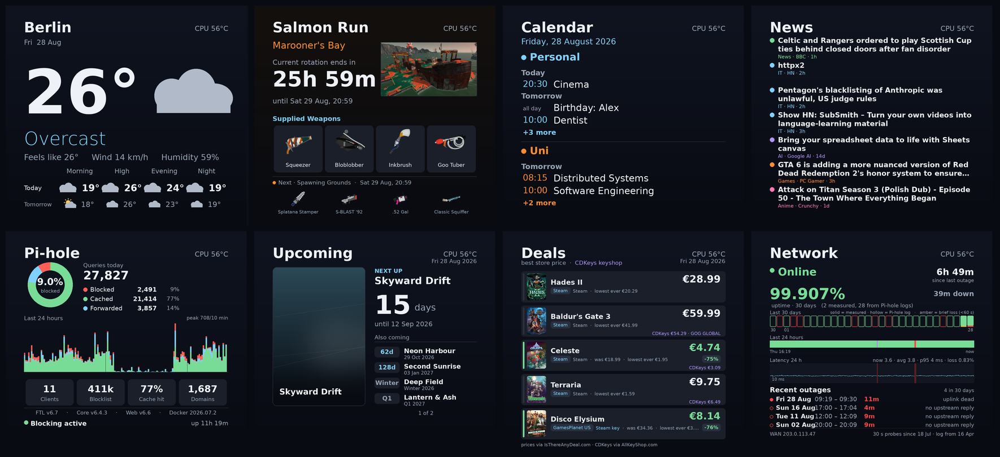

# Infoscreen

An always on information display for a Raspberry Pi. Eight screens take turns on the left side of
a 1920x1080 HDMI touch display while a clip or a still image loops on the right. There is no
browser and no desktop. One mpv process is the whole display. It plays the media and paints
everything else as GPU overlays, a Lua script inside mpv picks the screen and routes touches, and
each screen is a small Python script that draws a bitmap with Pillow. The whole thing idles at a
few percent of one core, right next to the Pi-hole on the same box.

This is built for one person and one wall, so the mix of topics follows my own taste. Take the
parts that suit you and throw the rest away.



The screenshot was taken from a copy filled with example configuration, so the calendar, the
release list and the network history are invented.

## Features

* **Weather** with current conditions and four slots for today and tomorrow, namely morning, the
  daily high, evening and night. It asks open-meteo first and falls back to met.no.
* **Salmon Run** with the current Splatoon 3 rotation, its weapons, a countdown and the next
  rotation. A Big Run, an Eggstra Work or a Splatfest gets its own banner and colours as soon as
  it is announced.
* **Calendar** from any number of subscribed iCal feeds in two bands, with Google Tasks as an
  option.
* **News** headlines from RSS and Atom feeds, mixed by a fixed quota per category so one busy feed
  cannot crowd out the rest.
* **Pi-hole** figures from the v6 API on the same box, with queries today, the blocked share and
  the last 24 hours.
* **Upcoming** release countdowns from a hand curated list. Vague dates such as `Q1 2027` or `TBA`
  work too.
* **Deals** with the cheapest store price in EUR for a watchlist, from IsThereAnyDeal plus CDKeys
  through AllKeyShop. Gold marks the lowest price ever and green a normal sale.
* **Network** uptime and latency of the uplink, with a 30 day strip, the last 24 hours and a list
  of outages.
* Tap the left panel for the next screen and the video for the next clip. The screens also cycle
  on their own every 15 minutes, and the next one is rendered before the switch.
* The brightness follows the sun, worked out from the location and the clock with no sensor.
* Every screen degrades instead of crashing. A dead API shows the last good render with a marker,
  and a missing config shows an empty panel or a setup hint.
* Adding a screen needs no code change. Make a `screens/<key>/` directory, drop a script into it
  and add a line to `screens.conf`.

## Running it yourself

Tested on a Raspberry Pi 4 Model B with Raspberry Pi OS Bookworm, Python 3.11, Pillow 9.4, mpv
0.35.1 and labwc 0.8.4, on a 1920x1080 HDMI touch display.

```bash
git clone https://github.com/Tobias2909/Infoscreen.git ~/infoscreen
cd ~/infoscreen

# Pillow and mpv come from the distro. Two screens need three extra packages.
sudo apt install mpv labwc python3-pil
python3 -m venv --system-site-packages venv
./venv/bin/pip install icalendar recurring_ical_events feedparser

cp location.example.json          location.json
cp playlist.example.txt           playlist.txt
cp screens/news/news_feeds.example.json      screens/news/news_feeds.json
cp screens/deals/watchlist.example.json      screens/deals/watchlist.json
cp screens/releases/countdowns.example.json  screens/releases/countdowns.json
# then edit each one, drop some clips into media/, and start it
./kiosk.sh
```

`kiosk.sh` needs a running Wayland session and sets `XDG_RUNTIME_DIR` and `WAYLAND_DISPLAY`
itself. One user cron line is the whole autostart, and nothing needs root.

```cron
03 5 * * * /home/<user>/infoscreen/kiosk.sh >/tmp/kiosk.log 2>&1
```

The Network screen also needs its monitor running. The daemon `screens/net/netmon.py` is in the
repo, but its systemd unit is not, and the interface name `eth2` near the top of the file has to
match your uplink. Without the daemon the screen says the monitor is offline and the rest carries
on.

## Configuration

`screens.conf` lists the screens in order, one per line as `key:script:refresh_seconds`, where 0
means a screen only renders when you arrive at it. Delete a line to drop a screen.

| File | What it is |
|---|---|
| `location.json` | `lat`, `lon`, `tz` and `label` for the weather and the brightness |
| `contact.txt` | optional contact string that met.no asks clients to send |
| `playlist.txt` | one media file per line, relative to `media/` |
| `screens/news/news_feeds.json` | the feeds, each with a category, a short label and a URL |
| `screens/deals/watchlist.json` | game titles for the deals screen |
| `screens/releases/countdowns.json` | titles, dates and cover URLs for the release list |
| `screens/cal/calendars.json` | iCal feeds with a label and a colour. Secret URLs, so `chmod 600` |
| `screens/cal/google_tasks_oauth.json` | optional Google Tasks credentials |
| `screens/deals/itad_api.json` | API key from <https://isthereanydeal.com/apps/my/> |
| `screens/pihole/pihole_api.json` | Pi-hole app password |

Only `screens.conf` is tracked. Every file in the table is ignored by git because it is either a
secret or a personal choice. Where an `.example` twin exists, copy it and edit it.

## License

MIT, see [LICENSE](LICENSE). Data comes at runtime from [open-meteo](https://open-meteo.com),
[met.no](https://api.met.no), [splatoon3.ink](https://splatoon3.ink),
[IsThereAnyDeal](https://isthereanydeal.com), [AllKeyShop](https://www.allkeyshop.com) and
[SteamGridDB](https://www.steamgriddb.com). None of their code is included here.
